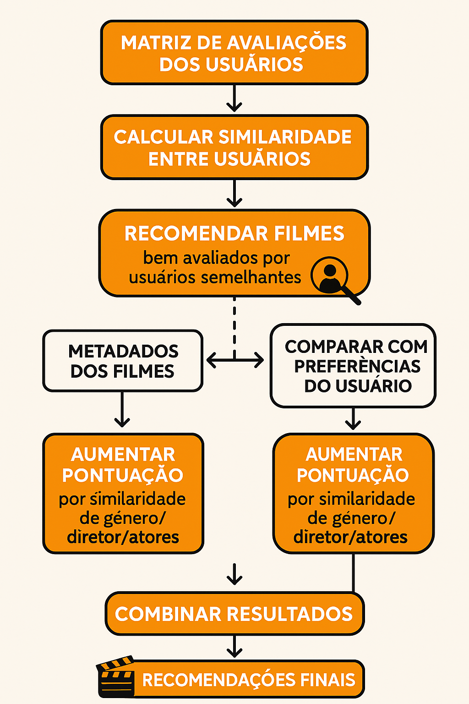

# 🎬 Movie Recommender API

<p align="center">
  
</p>

✨ Uma API inteligente de recomendação de filmes baseada em avaliações de usuários, gêneros, diretores e atores preferidos. Construída com **FastAPI + Python** para o [desafio técnico de Engenheiro de Software Pleno](https://github.com/23jonathan23/biso-technical-case-mid-level-software-engineer) da **BISO**.

---

## ✨ Funcionalidades

🔹 Cadastro de usuários  
🔹 Registro de filmes com gênero, diretor e atores  
🔹 Sistema de avaliações (nota de 0 a 5)  
🔹 Recomendação personalizada de filmes com base em:

- 🎯 Preferências do usuário (gêneros, diretores e atores)
- 🧠 Algoritmos de **filtragem colaborativa** e **baseada em conteúdo**
- 🤝 Similaridade com outros usuários

---

## ⚙️ Tecnologias

- 🐍 Python 3.12
- ⚡ FastAPI
- 💃 SQLite
- 🌐 Uvicorn (ASGI server)
- 🧪 Pytest (testes automatizados)

---
## ✅ Checklist

### 📝 Requisitos Funcionais

| Requisito                                              | Status       |
|--------------------------------------------------------|--------------|
| O sistema deve ser capaz de recomendar filmes semelhantes aos que o usuário já assistiu. | ✅ Concluído   |
| Os usuários devem poder avaliar filmes (por exemplo, com estrelas ou likes). | ✅ Concluído   |
| A recomendação deve levar em consideração filmes assistidos, avaliações, gêneros, diretores e atores favoritos. | ✅ Concluído   |
| Endpoint `/filmes`: Retorna a lista de todos os filmes disponíveis. | ✅ Concluído   |
| Endpoint `/filmes/{usuario_id}/recomendacoes`: Retorna as recomendações personalizadas para o usuário com o ID especificado. | ✅ Concluído   |

---

### 🛠️ Requisitos Técnicos

| Requisito                                              | Status       |
|--------------------------------------------------------|--------------|
| Utilizar Python como linguagem de programação.        | ✅ Concluído   |
| Utilizar um banco de dados (SQLite) para armazenar informações sobre filmes, usuários e avaliações. | ✅ Concluído   |
| Implementar algoritmos de recomendação (filtragem colaborativa e baseada em conteúdo). | ✅ Concluído   |
| Criar uma API usando FastAPI para exportar endpoints.  | ✅ Concluído   |
| Documentar a API para que os usuários saibam como usá-la. | ✅ Concluído   |

---

### ⚡ Critérios de Avaliação

| Critério                                              | Status       |
|--------------------------------------------------------|--------------|
| **Qualidade do Código**: Estrutura, modularidade, boas práticas de programação. | ✅ Concluído   |
| **Funcionalidade**: O sistema de recomendação deve funcionar conforme especificado. | ✅ Concluído   |
| **Documentação**: A documentação da API deve ser clara e completa. | ✅ Concluído   |
| **Desempenho**: O sistema deve ser eficiente e escalável. | ✅ Concluído   |

---

## 🏗️ Como rodar o projeto

### 1️⃣ Clone o repositório

```bash
git clone https://github.com/strongreen/movie-recommender.git
cd movie-recommender
```

### 2️⃣ Instale as dependências

```bash
pip install -r requirements.txt
```

### 3️⃣ Inicie o servidor

```bash
uvicorn app.main:app --reload
```

Acesse a documentação interativa da API:

- 🔍 Swagger UI: [http://localhost:8000/docs](http://localhost:8000/docs)  
- 📜 ReDoc: [http://localhost:8000/redoc](http://localhost:8000/redoc)

---

## 🧪 Rodando os testes

```bash
pytest --cov=app --cov-report=term-missing
```

Verifica cobertura de testes e garante que tudo está funcionando 💯

---

## 🔁 Endpoints disponíveis

📁 **/filmes**  
- `POST /filmes`: Adiciona um novo filme  
- `GET /filmes`: Lista todos os filmes cadastrados  
- `GET /filmes/{movie_id}`: Lista um filme pelo ID  
- `DELETE /filmes/{movie_id}`: Deleta um filme pelo ID 

👤 **/usuarios**  
- `POST /usuarios`: Cria um novo usuário  
- `GET /usuarios`: Lista todos os usuários cadastrados  
- `GET /usuarios/{user_id}`: Lista um usuário pelo ID  
- `DELETE /usuarios/{user_id}`: Deleta um usuário pelo ID 

⭐ **/classificacoes**  
- `POST /classificacoes`: Avalia um filme 
- `GET /classificacoes/{user_id}`: Lista as classificações do usuário
- `GET /classificacoes/{user_id}`: Lista as classificações do filme


🎯 **/classificacoes/{usuario_id}/recomendacoes**  
- `GET /classificacoes/{user_id}/recomendacoes`: Retorna filmes recomendados para o usuário com base nas suas avaliações e gostos

---

## 🧠 Como funciona a recomendação

O sistema combina duas estratégias:

### 🔗 Filtragem Colaborativa
- Analisa a similaridade entre usuários com base nas avaliações feitas
- Indica filmes que usuários semelhantes gostaram

### 👬 Filtragem Baseada em Conteúdo
- Considera atributos dos filmes (gênero, diretor, atores)
- Reforça recomendações com base nas preferências do usuário

---
### 🎯 Diagrama do sistema de filtragem
- Busca todas as avaliações (`user_id`, `movie_id`, `score`) do banco de dados.
```
ratings = session.exec(select(Rating)).all()
```
- Forma uma matriz de `usuários x filmes`, preenchendo com `0` onde o usuário não avaliou um filme.
```
rating_matrix = df.pivot_table(index='user_id', columns='movie_id', values='score').fillna(0)
```
- Calcula a semelhança do usuário atual com todos os outros usando `cosine similarity`. Quanto maior o valor, mais parecidos são os padrões de avaliação.
```
cosine_sim = cosine_similarity(rating_matrix)
```
- Pega os usuários que têm alguma similaridade positiva com o usuário atual. Esses são candidatos para gerar recomendações.
```
similar_users = {other_id: user_similarities[i] for i, other_id in enumerate(rating_matrix.index) if other_id != user_id and user_similarities[i] > 0}
```
- Garante que não vai recomendar filmes que ele já viu.
```
user_movies = set(df[df.user_id == user_id].movie_id)
```
- Cria um dicionário com informações dos filmes. Isso erá usado para comparar se um filme recomendado tem atributos em comum com os filmes que o usuário já viu.
```
movie_info = {movie.id: (movie.genre, movie.director, movie.actors.split(", ")) for movie in movies}
```
- Para cada filme que um usuário semelhante viu: Soma o score avaliando também a similaridade entre os usuários.
```
candidate_scores[row.movie_id] += row.score * similarity
```
- Basea o conteúdo da recomendação com reforço por similaridade de conteúdo
```
candidate_scores[row.movie_id] += 0.5
```
- Retorna os filmes ordenados pela pontuação final (nota ponderada + reforços)
```
sorted_movies = sorted(candidate_scores.items(), key=lambda x: x[1], reverse=True)
```

<p align="center">
  
</p>

---

## 📦 Estrutura do Projeto

```
movie-recommender/
├── app/
│   ├── main.py            # Inicialização do FastAPI
│   ├── database.py        # Configuração do banco de dados
│   ├── models.py          # ORM com SQLModel
│   ├── schemas.py         # Schemas Pydantic (com validação e segurança aplicadas)
│   ├── recommender.py     # Algoritmo de recomendação
│   ├── routers/           # Rotas organizadas por recurso
│   │ ├── movies.py
│   │ ├── ratings.py
│   │ └── users.py
├── tests/             # Rotas de testes organizadas por recurso
│   ├── test_movies.py
│   ├── test_rating.py
│   ├── test_recommendations.py
│   └── test_users.py
├── seed.py          # Banco populado com dados fictícios
└── requirements.py       
```

---

## 💪 Medidas de Segurança

- ❌ **Proteção contra requisições indevidas (CORS Middleware)**:

```python
app.add_middleware(
    CORSMiddleware,
    allow_origins=["https://www.biso.digital/"], 
    allow_credentials=True,
    allow_methods=["GET", "POST"],
    allow_headers=["*"],
)
```

- ✅ **Sanitização e validação de campos com `Field` (Pydantic)**
  - Restrições de `pattern`, `min_length`, `max_length` aplicadas a `title`, `genre`, `director` e `actors`

- ⚠️ **Tratamento genérico de exceções com retorno seguro**

```python
@app.exception_handler(Exception)
async def generic_exception_handler(request: Request, exc: Exception):
    return JSONResponse(
        status_code=500,
        content={"detail": "Por medida de Segurança: Esse erro é interno do servidor. Entre em contato com o Administrador"},
    )
```

---
## 🛠️ Melhorias

Foi criado um segundo README para sugerir melhorias futuras para o projeto
[Melhorias sugeridas](/improvements/README.md)

---

## 📄 Licença

Distribuído sob a licença **MIT**. Veja `LICENSE` para mais detalhes.

---

Se curtiu, deixa uma ⭐ no GitHub!  
Feito com 💙 por [strongreen](https://github.com/strongreen)
